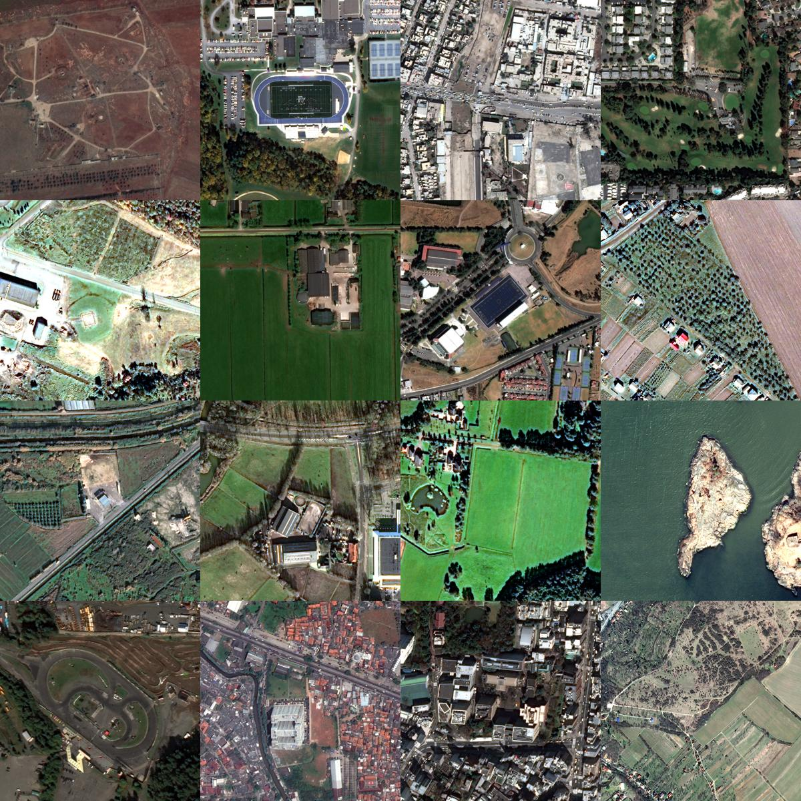

# JPEG2000 Benchmarking

Using a random bunch of RGB images from the Functional-Map-of-the-World geospatial dataset (https://arxiv.org/abs/1711.07846) to guage how effective JPEG2000 lossless compression on natural scenes is. The dataset is huge, so I only used 15802 images.



# Compression

Used the J2K codec within OpenJPEG. Invoked it for all the sorted files.

```bash
opj_compress -ImgDir /your/image/dir  -OutFor JP2 -threads ALL_CPUS

# Set the root dir in the script, TODO: Take in cmdline arg for dir path instead. 
python3 analyse_compression 
```

# Results

As seen in this histogram, the compression ratio you get is around 2-3x for satellite imagery too.

